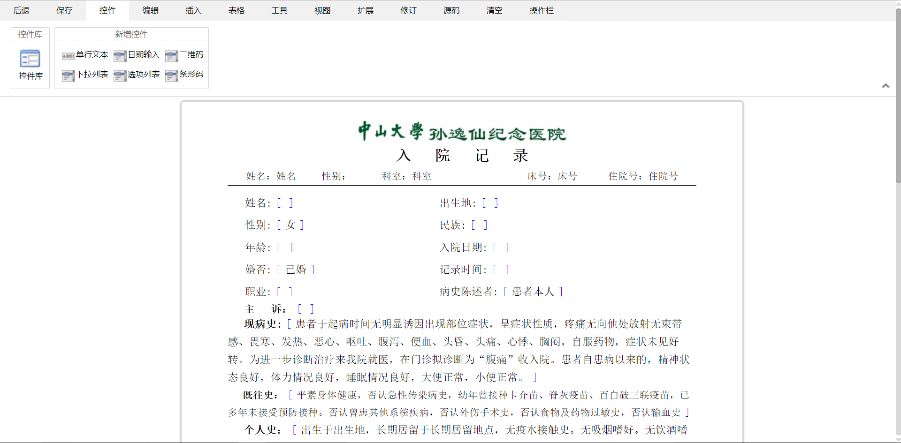
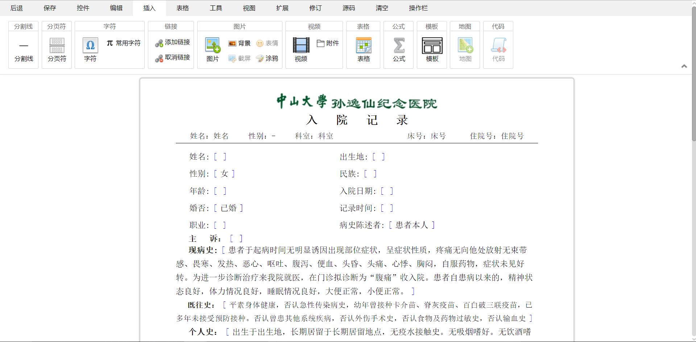
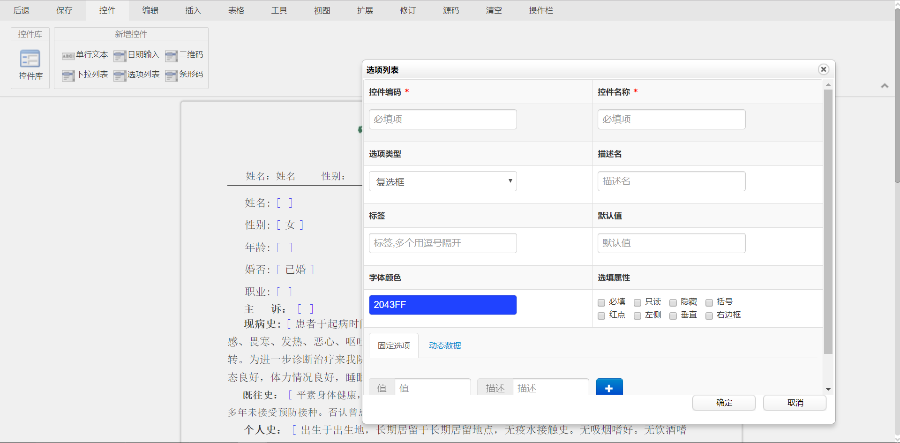

# 电子病历编辑器
###### i. 剪切板
    1.复制、纯文本粘贴、带格式粘贴、切剪
    2.控件复制粘贴（包含控件sde-model属性及所带事件）
######   ii. 字体
    1. 字体、字号、增大字体、缩小字体
    2. 字体设置颜色及背景色
###### iii 插入
    i. 字符
    ii. 链接
        1. 插入链接、取消链接
        2. 插入折线图链接 
    iii. 图片
        1. 图片放大、涂鸦、图片上添加文字
    iv. 表格
        1. 插入表格
        2. 表格设置边框线（上下左右、外围、内部、所有、清除）
    v. 公式（节点形式）
        1. 公式插入后可编辑且可回写
    vi. 视频
        1. 支持在编辑器内播放插入的视频
    vii. 条形码,二维码
        1. 支持设置宽高及内容
######   控件
        1. 文本控件、日期控件、下拉控件
```
（20180409 17.00）发布新包，版本号 2.1.0.20180409.17-SNAPSHOT，版本备份:无
更新内容：
    1.增加趋势图点击折点,折点数据回写到指定id控件中;
    2.控件树优化,支持模糊搜索;
    3.修复控件侧面,特殊情况下光标点不进的问题;
    4.切换页面....光标点不进的问题.
    5.双击点不进的问题.
    6.删除控件.还会有源码存在的问题
```
```
（20180327 18.00）发布新包，版本号 2.1.0.20180327.18-SNAPSHOT，版本备份:无
更新内容：
    1.修复复制控件时出现复制一行内容及有时出现复制粘贴单个控件损坏的问题;---Nothing
    2.修复复制下拉控件时,下拉框错位问题;---Nothing
    3.修复涂鸦功能中输入框不能输入文字问题;---Nothing
    4.优化tab切换光标定位不准确问题;---Nothing
    5.控件点击时,需要调用自定义方法的功能:通过sdeUserFun对象绑定自定义方法.---king
    6.修复涂鸦后图片打印显示不出来的问题---king
    7.添加一个新对象:sdeAction...该对象主要提供与后台交互接口.默认用变量sdeaction初始化使用---king
    8.新增一个接口:sdeAction.base64ToImg(base64Str,uploadType,actionType)---king
             * 描述: 通过同步请求更新base64图片
             * 参数: base64Str:  一个base64字符串
             *      uploadType: 更新类型.1本地更新.2fastdfs更新
             *      actionType: 涂鸦更新等,默认uploadscrawl更新....具体看com.ry.editor.template.ueditor.define.ActionMap
             *
             * 返回参数:JSON
             *      suffixType: 后缀类型
             *      uploadType: 更新类型.1本地更新.2fastdfs更新
             *      msg:        消息
             *      code:       编码:500失败.200成功
             *      url:        上传后图片路径
    9.修复文本控件编辑时控件限定长度无法回写的问题---king
    10.修复设置行距.保存病程记录导致报错的问题---king
    数据库增量脚本SVN序号为: 0020(无变化)
```
## 效果展示



## 编辑器模式
###### 1. [设计模式--电子病历设计器(扩展toolbar)]
```
建议给病历模板设计者（开发人员，或者科主任）使用。
可用来设计电子病历模板，也可以当做电子病历编辑器使用。
此时输入的值可利用SDE对象暴露出的接口获取。
增加自定义toolbar标题功能，可支持多语言。
```
###### 2. [编辑模式--电子病历设计器]
```
建议给医生使用。
此时医生可以在原有模板中添加已有的控件，也可以给科主任用来设计模板。
亦可通过SDE对象暴露出来的接口获取数据。
```
###### 3. [只读模式--电子病历设计器]
```
建议该模式给医生查看使用，在该模式下电子病历中所有控件均不可编辑。
```
## 目录结构
```shell
--data                    模拟异步请求的数据，正式项目中可忽略
--dialogs                 扩展百度ueditor的dialogs
--lang                 	toolbar多语言支持，可自定义toolbar标题
--dist--                    核心js文件
    js--
      --sde.design3.js   SoDiaoEditor设计器核心js
      --sde.editor3.js   SoDiaoEditor编辑器核心js
--example                 一些demo
--ueditor                 百度ueditor库，可替换成自己版本
--sde.config.js           核心配置文件
```
## 使用说明
##### 电子病历设计器：
```
<!DOCTYPE html>
<html lang="zh-CN">

<head>
    <meta charset="utf-8">
    <meta http-equiv="X-UA-Compatible" content="IE=edge">
    <meta name="viewport" content="width=device-width, initial-scale=1">
    <title>设计模式--电子病历设计器</title>
    <!-- 注意以下各脚本之间的加载顺序！ -->
    <script type="text/javascript" src="sde.config.js"></script>
    <link rel="stylesheet" href="ueditor/themes/default/css/ueditor.css" />
    <script type="text/javascript" src="ueditor/ueditor.all.js"></script>
    <script type="text/javascript" src="ueditor/lang/zh-cn/zh-cn.js"></script>
    <script type="text/javascript"  src="dist/js/sde.design.js"></script>
</head>
<body>
    <script id="myEditor" type="text/plain" style="width:680px;height:1000px;">
        病历模板...
    </script>
    <script type="text/javascript">
        window.onload = function() {
            var sde = new SDE({
                id: "myEditor",
                title: '<div style="height: 45px;overflow: hidden;background-color: #16742B;">' +
                    '<div class="left" style="position:absolute;top:0;left:0;">' +
                    '' +
                    '</div>' +
                    '<h1 style="font-size: 14px;height: 45px;line-height: 45px;margin: 0 auto;text-align: center;font-weight: normal;color:#fff;" >SoDiaoEditor电子病历编辑器</h1>' +
                    '</div>', //自定义title
				iframe_js_src: "", //iframe中添加js脚本，可以为string或Array类型。例如："xx/xx.js"或者["aa/aa.js","bb/bb.js"]
				iframe_css_src: "" //iframe中添加css脚本，可以为string或Array类型。例如："xx/xx.css"或者["aa/aa.css","bb/bb.css"]
            });
        };
    </script>
</body>
</html>
```
###### 注意：
> 各个脚本之间的加载顺序，已本例为准。
配置项(sde.config.js)：
```
/*
默认配置项
*/
(function() {
    var URL = window.UEDITOR_HOME_URL || getUEBasePath();
    /*
    SDE_CONFIG 配置项
    */
    window.SDE_CONFIG = {
        HOME_URL: URL,
        HOME_URL_DIALOGS: URL + 'dialogs/',//SoDiaoEditor扩展ueditor的dialogs位置
        EDITOR_URL: URL + 'dist/js/sde.editor.js',
        MODE: "DESIGN", //DESIGN:设计|EDITOR:编辑|READONLY:只读（所有节点都不可编辑）
        CONTROL_TEMPLATES: [],//控件模板
		PLUGINS:[]//toolbar中扩展的组件
    };
    /**
     * 配置项主体。注意，此处所有涉及到路径的配置别遗漏URL变量。
     */
    window.UEDITOR_CONFIG = {
        UEDITOR_HOME_URL: URL + 'ueditor/', //为编辑器实例添加一个路径，这个不能被注释
        serverUrl: URL + "data/config.json", //URL + "net/controller.ashx", // 服务器统一请求接口路径
        toolbars: [], //工具栏上的所有的功能按钮和下拉框，可以在new编辑器的实例时选择自己需要的重新定义
        autoClearinitialContent: false, //是否自动清除编辑器初始内容，注意：如果focus属性设置为true,这个也为真，那么编辑器一上来就会触发导致初始化的内容看不到了
        //iframeJsUrl: URL + window.SDE_CONFIG.EDITOR_URL + '?temp=' + new Date().getTime(), //给编辑区域的iframe引入一个js文件
        // iframeCssUrl: URL + 'EMR/css/default.css?temp=' + new Date().getTime(), //给编辑区域的iframe引入一个css文件
        allowDivTransToP: false, //允许进入编辑器的div标签自动变成p标签
        wordCount: false, //关闭字数统计
        elementPathEnabled: false, //关闭elementPath
        autoClearinitialContent: false
    };
    function getUEBasePath(docUrl, confUrl) {
        return getBasePath(docUrl || self.document.URL || self.location.href, confUrl || getConfigFilePath());
    }
    function getConfigFilePath() {
        var configPath = document.getElementsByTagName('script');
        return configPath[configPath.length - 1].src;
    }
    function getBasePath(docUrl, confUrl) {
        var basePath = confUrl;
        if (/^(\/|\\\\)/.test(confUrl)) {
            basePath = /^.+?\w(\/|\\\\)/.exec(docUrl)[0] + confUrl.replace(/^(\/|\\\\)/, '');
        } else if (!/^[a-z]+:/i.test(confUrl)) {
            docUrl = docUrl.split("#")[0].split("?")[0].replace(/[^\\\/]+$/, '');
            basePath = docUrl + "" + confUrl;
        }
        return optimizationPath(basePath);
    }
    function optimizationPath(path) {
        var protocol = /^[a-z]+:\/\//.exec(path)[0],
            tmp = null,
            res = [];
        path = path.replace(protocol, "").split("?")[0].split("#")[0];
        path = path.replace(/\\/g, '/').split(/\//);
        path[path.length - 1] = "";
        while (path.length) {
            if ((tmp = path.shift()) === "..") {
                res.pop();
            } else if (tmp !== ".") {
                res.push(tmp);
            }

        }
        return protocol + res.join("/");
    }
    window.UE = {
        getUEBasePath: getUEBasePath
    };
})();
```
注意：
> 请重点关注window.SDE_CONFIG 和 window.UEDITOR_CONFIG 。 建议window.UEDITOR_CONFIG不要修改，可根据需求该window.SDE_CONFIG对象
##### 电子病历编辑器：

```
<!DOCTYPE html>
<html lang="zh-CN">
<head>
    <meta charset="utf-8">
    <meta http-equiv="X-UA-Compatible" content="IE=edge">
    <meta name="viewport" content="width=device-width, initial-scale=1">
    <title>编辑模式--电子病历编辑器</title>
    <script type="text/javascript" src="dist/js/sde.editor.js"></script>
</head>
<body>
    <div id="myEditor" style="width:680px;height:1000px;margin:0 auto;">
        病历内容...
    </div>
    <script type="text/javascript">
        window.onload = function() {
            var sde = new SDE({
                id: "myEditor",
                title: '<div style="height: 45px;overflow: hidden;background-color: #16742B;">' +
                    '<div class="left" style="position:absolute;top:0;left:0;">' +
                    '' +
                    '</div>' +
                    '<h1 style="font-size: 14px;height: 45px;line-height: 45px;margin: 0 auto;text-align: center;font-weight: normal;color:#fff;" >SoDiaoEditor电子病历编辑器</h1>' +
                    '</div>', //自定义title
                mode: 'EDITOR'//配置模式
            });
        };
    </script>
</body>
</html>
```


## API文档
##### 电子病历设计器：
方法 | 说明 | 描述
---|---|---
ready(function(){}) | 编辑器加载完成 | (之后的所有方法必须在ready加载完成后使用）
html([html]) | 获取/设置所有编辑器中的html模板 | 如果html不传递，则为获取，有值则为设置
getControl([id]) | 获取编辑器中的控件 | id为可选，若为无则是获取所有控件
setControl(ctl) | 设置编辑器中指定id的控件值 | ctl：{ID:'',VALUE:''}如果是select控件类型ctl：{ID:'',VALUE:'',TEXT:''}。ctl可以为数组也可以为对象，设置冻结READONLY：1为冻结，只读不可操作
deleteControl(id) | 删除编辑器中的控件 | id为必填
showControl(id) | 显示编辑器中的控件 | id为必填
hideControl(id) | 隐藏编辑器中的控件 | id为必填
setMode(mode) | 设置编辑器模式 | mode可选：DESIGN（设计）、EDITOR（编辑）、READONLY（只读）
showSource() | 切换源码模式和正常编辑模式 | 切换源码模式和正常编辑模式
moveToControlPosition(id) | 定位到指定控件位置 | 因为页面可能存在多个id相同的控件，所以可以多次调用，定位到需要的位置。id为控件的id
unCheckControl() | 去除执行checkControl时发现错误值加的背景色 | 
checkControl(obj) | 校验控件值是否符合要求 | 具体使用如下：
```
//调用方式如下
sde.checkControl({
	id:"可选，也可不写，如果不填就是校验所有控件！"
	error:function(obj){//错误信息时触发，其中obj：{model:{json对象},msg:"错误信息！"}
		console.log(obj);
	},success:function(){//校验成功时触发
		console.log('success!!!');
	}
},false/true);//默认为false，如果为true表示校验所有控件，如果为false表示发现不符合规则的控件值即停止往下检查。为true且发现同时有多个控件不符合要求时 error会被触发多次
请同时更新dialogs/text.html文件！
```

##### 设计器完整配置
```
//默认配置
    defaultOptions: {
        id: '',
        title: '', //  //电子病历标题
		width:664,//可不写，默认宽度：664
        control_templates: [],
        controls: [], //需要设置的controls的值
        mode: '', //优先去里面值
        footer: 'SoDiaoEditor v2.0 电子病历编辑器',
        //其顺序保证了页面序列化时的顺序
        toolbars: {
            'sde-toolbar-file': 'file',
            'sde-toolbar-editor': ['history', 'clipboard', 'fonts', 'paragraphs', 'styles'],
            'sde-toolbar-insert': ['horizontal', 'spechars', 'link', 'img', 'map', 'code', 'table', 'formula', 'comment'],
            'sde-toolbar-tables': ['table', 'blockmergecells', 'alignmergecells'],
            'sde-toolbar-views': ['directory', 'showcomment', 'preview'],
            'sde-toolbar-tools': ['drafts', 'print', 'searchreplace', 'wordcount'],
            'sde-toolbar-records': ['sdetemplate', 'sdecontrols'],
        },
        iframe_js_src: "", //iframe中添加js脚本
        iframe_css_src: "" //iframe中添加css脚本
    }
```

##### toolbar完整配置项
```
toolbars: {
    'sde-toolbar-file': 'file',//文件
    'sde-toolbar-editor': ['history', 'clipboard', 'fonts', 'paragraphs', 'styles'],//编辑
    'sde-toolbar-insert': ['horizontal', 'spechars', 'link', 'img', 'map', 'code', 'table', 'formula', 'comment'],//插入
    'sde-toolbar-tables': ['table', 'blockmergecells', 'alignmergecells'],//表格
    'sde-toolbar-views': ['directory', 'showcomment', 'preview'],//视图
    'sde-toolbar-tools': ['drafts', 'print', 'searchreplace', 'wordcount'],//工具
    'sde-toolbar-records': ['sdetemplate', 'sdecontrols']//病历控件
}
```
##### 电子病历编辑器：
方法 | 说明 | 描述
---|---|---
html([html]) | 获取/设置所有编辑器中的html模板 | 如果html不传递，则为获取，有值则为设置
getControl([id]) | 获取编辑器中的控件 | id为可选，若为无则是获取所有控件
setControl(ctl) | 设置编辑器中指定id的控件值 | ctl：{ID:'',VALUE:''}如果是select控件类型ctl：{ID:'',VALUE:'',TEXT:''}。ctl可以为数组也可以为对象，设置冻结READONLY：1为冻结，只读不可操作
deleteControl(id) | 删除编辑器中的控件 | id为必填
showControl(id) | 显示编辑器中的控件 | id为必填
hideControl(id) | 隐藏编辑器中的控件 | id为必填
setMode(mode) | 设置编辑器模式 | mode可选：DESIGN（设计）、EDITOR（编辑）、READONLY（只读）
moveToControlPosition(id) | 定位到指定控件位置 | 因为页面可能存在多个id相同的控件，所以可以多次调用，定位到需要的位置。id为控件的id
unCheckControl() | 去除执行checkControl时发现错误值加的背景色 | 
checkControl(obj) | 校验控件值是否符合要求 | 具体使用如下：
```
//调用方式如下
sde.checkControl({
	id:"可选，也可不写，如果不填就是校验所有控件！"
	width:664,//可不写，默认宽度：664
	error:function(obj){//错误信息时触发，其中obj：{model:{json对象},msg:"错误信息！"}
		console.log(obj);
	},success:function(){//校验成功时触发
		console.log('success!!!');
	}
},false/true);//默认为false，如果为true表示校验所有控件，如果为false表示发现不符合规则的控件值即停止往下检查。为true且发现同时有多个控件不符合要求时 error会被触发多次
请同时更新dialogs/text.html文件！